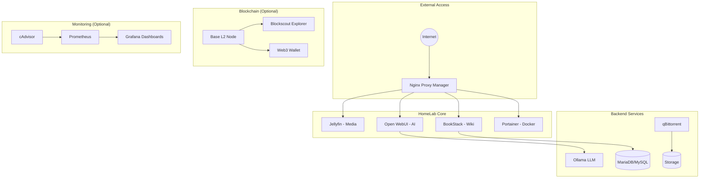

# 🏠 HomeLab Infrastructure

> **Self-hosted sovereignty** - Your data, your rules, no cloud dependencies.

```
╔══════════════════════════════════════════════════════════════════════════════╗
║  ██╗  ██╗ ██████╗ ███╗   ███╗███████╗██╗      █████╗ ██████╗                 ║
║  ██║  ██║██╔═══██╗████╗ ████║██╔════╝██║     ██╔══██╗██╔══██╗                ║
║  ███████║██║   ██║██╔████╔██║█████╗  ██║     ███████║██████╔╝                ║
║  ██╔══██║██║   ██║██║╚██╔╝██║██╔══╝  ██║     ██╔══██║██╔══██╗                ║
║  ██║  ██║╚██████╔╝██║ ╚═╝ ██║███████╗███████╗██║  ██║██████╔╝                ║
║  ╚═╝  ╚═╝ ╚═════╝ ╚═╝     ╚═╝╚══════╝╚══════╝╚═╝  ╚═╝╚═════╝                 ║
║                                                                              ║
║  HomeLab - Self-Hosted Infrastructure Stack                                  ║
╚══════════════════════════════════════════════════════════════════════════════╝
```

[](https://github.com/kenj4mes/home.lab/actions/workflows/lint.yml)
[](https://opensource.org/licenses/MIT)

---

## 🎯 Technical Interview Profile

> **Self-hosted infrastructure platform with 50+ integrated services, designed for offline sovereignty and multi-domain expertise.**

<details>
<summary><b>📊 Core Competencies</b></summary>

| Domain | Proficiency | Level |
|--------|-------------|-------|
| Container Orchestration | ★★★★★ | Senior |
| Local AI/LLM Operations | ★★★★★ | Expert |
| Blockchain Infrastructure | ★★★★☆ | Mid-Senior |
| Network Security | ★★★★☆ | Mid-Senior |
| Creative AI Pipelines | ★★★★☆ | Mid-Senior |
| Quantum Computing | ★★★☆☆ | Junior-Mid |
| SDR/Radio Research | ★★★☆☆ | Specialist |

</details>

<details>
<summary><b>💬 Technical Q&A</b></summary>

**Q: AI Capabilities?**
> 15+ LLMs (Llama 3.2, DeepSeek-R1, Mistral, CodeLlama) via Ollama + Open WebUI. Multi-agent orchestration with LangGraph, CrewAI, AutoGen. Creative suite: SDXL, Bark TTS, Whisper, MusicGen.

**Q: Blockchain Experience?**
> 31 OP-Stack L2 nodes (Base, OP, Unichain, Mode, World, Lisk). Full Web3 dev with Hardhat 3, Foundry, Anvil, Blockscout.

**Q: Security Approach?**
> Post-Quantum TLS (Kyber768), HashiCorp Vault, cryptographic secrets, `no-new-privileges` containers.

**Q: Offline Capable?**
> 100% air-gapped: 26GB LLMs + 22GB ZIM files + 50GB Creative AI models. Copy folder → deploy anywhere.

</details>

<details>
<summary><b>🛠️ Skills Matrix</b></summary>

```
Languages:     Docker Compose, Bash, PowerShell, Python, TypeScript, Solidity
Platforms:     Docker, Proxmox, Windows, Linux (Debian/Ubuntu/Fedora/Arch)
AI/ML:         Ollama, Transformers, Diffusers, ONNX, CUDA
Blockchain:    OP-Stack, EVM, Hardhat, Foundry, Web3.py, ethers.js
Security:      Post-Quantum Crypto, Vault, TLS 1.3, OQS-OpenSSL
Networking:    Nginx, Pi-hole, TURN/STUN, Matrix federation
```

</details>

---

## ✨ Features

- **🤖 Local AI** - Run Ollama with Open WebUI (ChatGPT-like interface) 100% offline
- **🎬 Media Server** - Jellyfin for your personal Netflix experience
- **📚 Offline Knowledge** - Kiwix with Wikipedia, Stack Overflow, and more
- **📝 Documentation** - BookStack personal wiki
- **🔗 Blockchain** - Optional Base L2 node with explorer and wallet API
- **📊 Monitoring** - Prometheus + Grafana + Loki stack
- **🔒 Security** - Secure secrets, health checks, and hardened containers
- **⚛️ Quantum-Ready** - Post-quantum TLS, QRNG, and quantum simulator
- **🌐 Web3 Development** - Hardhat 3, Foundry, Base L2 templates, and smart contract tooling
- **🤖 AI Agents** - LangGraph, CrewAI, AutoGen, and MCP server integration
- **🎨 3D Generation** - TRELLIS.2 image-to-3D model generation (GPU required)
- **🎭 Creative AI Studio** - Stable Diffusion, ComfyUI, Bark TTS, Whisper, MusicGen, Video Diffusion
- **🔐 Post-Quantum TLS** - OpenQuantumSafe NGINX with Kyber768 hybrid key exchange
- **⛓️ Superchain Ecosystem** - 31 OP-Stack L2 nodes (Base, OP, Unichain, Mode, World, Lisk)
- **📡 SDR & Radio Security** - IMSI catcher detection, LTESniffer, srsRAN 5G (research only)
- **💬 Matrix Synapse** - Self-hosted encrypted messaging with Element client
- **📴 Offline-First** - Complete offline operation with dependency caching
- **🔄 Idempotent** - Safe to run multiple times
- **🧙 Install Wizard** - Interactive setup with component selection

## 🏗️ Architecture



## 🎯 Quick Start

### 🧙 Install Wizard (Recommended)

The interactive Install Wizard guides you through setup with folder selection and component choices:

```powershell
# Run as Administrator
.\install\install-wizard.ps1
```

The wizard will:
1. Let you choose the installation folder (with browse dialog)
2. Select which components to install (Core, AI, Blockchain, SDR, etc.)
3. Copy dependencies (ZIM files, SDR tools) if you have them
4. Generate secure passwords and configure services
5. Start selected services

### 🖥️ Windows PC (Quick Setup)

For automated setup without the wizard:
```powershell
# Run as Administrator
.\install\setup-windows.ps1
```
Manage services with the unified CLI:
```powershell
.\homelab.ps1 -Action status
.\homelab.ps1 -Action start
.\homelab.ps1 -Action logs -Service jellyfin
```

### 🐧 Linux / Proxmox VM
One-liner bootstrap (Debian, Ubuntu, Fedora, Arch):
```bash
curl -sSL https://raw.githubusercontent.com/kenj4mes/home.lab/main/bootstrap.sh | sudo bash
```

Or step-by-step:
```bash
git clone https://github.com/kenj4mes/home.lab.git
cd homelab
./scripts/env-generator.sh    # Generate secure secrets
./scripts/init-homelab.sh     # Install everything
```

## 📋 Unified CLI

The `homelab` CLI (available as `homelab.ps1` on Windows and `make` on Linux) provides a single interface for all operations.

| Action | PowerShell Command | Make (Linux) |
|--------|-------------------|--------------|
| **Start** | `.\homelab.ps1 -Action start` | `make start` |
| **Stop** | `.\homelab.ps1 -Action stop` | `make stop` |
| **Status** | `.\homelab.ps1 -Action status` | `make status` |
| **Logs** | `.\homelab.ps1 -Action logs` | `make logs` |
| **Update** | `.\homelab.ps1 -Action update` | `make update` |
| **Health** | `.\homelab.ps1 -Action health` | - |
| **Creative** | `.\homelab.ps1 -Action creative` | - |
| **PQTLS** | `.\homelab.ps1 -Action pqtls` | - |
| **Superchain** | `.\homelab.ps1 -Action superchain` | - |

### Download Models

```bash
# List available model groups
./scripts/download-models.sh --list-groups

# Download standard models (~15GB)
./scripts/download-models.sh --profile standard

# Download specific model
./scripts/download-models.sh --model dolphin-mistral:7b

# Download coding models
./scripts/download-models.sh --group code
```

### Blockchain Commands

```bash
make base-start     # Start Base L2 node + explorer
make base-status    # Check blockchain services
make base-logs      # View blockchain logs
```

## 📦 Services

### Core Services

| Service | Port | Description |
|---------|------|-------------|
| **Jellyfin** | 8096 | Media Server (Open-source Netflix) |
| **Open WebUI** | 3000 | ChatGPT-like interface for local AI |
| **Ollama** | 11434 | Local Large Language Model API |
| **BookStack** | 8082 | Personal Wiki & Documentation |
| **Kiwix** | 8081 | Offline Wikipedia & ZIM reader |
| **Portainer** | 9000 | Container Management UI |
| **Nginx Proxy** | 80/443 | Reverse Proxy & HTTPS |
| **qBittorrent** | 8080 | Torrent Client |

### Blockchain Services (Optional)

| Service | Port | Description |
|---------|------|-------------|
| **Base Node** | 8545/8546 | Base L2 RPC (HTTP/WS) |
| **Blockscout** | 4000 | Local Block Explorer |
| **Wallet CLI** | 5000 | REST API for wallet operations |

### Monitoring Stack (Optional)

| Service | Port | Description |
|---------|------|-------------|
| **Prometheus** | 9090 | Metrics Collection |
| **Grafana** | 3100 | Dashboards & Visualization |
| **Loki** | 3101 | Log Aggregation |
| **cAdvisor** | 8085 | Container Metrics |

### Quantum Services (Optional)

| Service | Port | Description |
|---------|------|-------------|
| **Quantum RNG** | 5001 | Quantum Random Number Generator |
| **Quantum Simulator** | 5002 | Qiskit/Cirq/PennyLane circuit runner |

### Web3 Development (Optional)

| Service | Port | Description |
|---------|------|-------------|
| **Anvil** | 8547 | Local Ethereum testnet |
| **Hardhat Node** | 8545 | Hardhat development node |
| **Blockscout Dev** | 4001 | Local block explorer |
| **TRELLIS.2** | 5003/7860 | Image-to-3D generation (GPU) |

### AI Agent Services (Optional)

| Service | Port | Description |
|---------|------|-------------|
| **Agent Orchestrator** | 5004 | LangGraph/CrewAI API |
| **MCP Server** | 5005 | Model Context Protocol |
| **ChromaDB** | 8000 | Vector store for RAG |
| **n8n** | 5678 | Workflow automation |

### SDR & Radio Security (Optional) ⚠️

> **Legal Warning**: For security research only. Check local laws before use.

| Service | Port | Description |
|---------|------|-------------|
| **SDR Dashboard** | 8585 | Unified SDR web interface |
| **Rayhunter** | 8580 | EFF IMSI catcher detector |
| **IMSI Catcher** | - | GSM IMSI detection (host network) |
| **LTESniffer** | - | LTE traffic analysis (host network) |
| **srsRAN 5G** | - | Open-source 5G gNB (host network) |

See [docs/SDR.md](docs/SDR.md) for hardware requirements and legal considerations.

### Matrix Synapse (Optional)

| Service | Port | Description |
|---------|------|-------------|
| **Element Web** | 8480 | Matrix web client |
| **Synapse** | 8008/8448 | Matrix homeserver |
| **Coturn** | 3478/5349 | TURN server for voice/video |

See [docs/MATRIX.md](docs/MATRIX.md) for setup and federation.

### Creative AI Studio (Optional) 🎨

> **GPU Required**: Most services need NVIDIA GPU with 8GB+ VRAM for optimal performance.

| Service | Port | Description |
|---------|------|-------------|
| **Stable Diffusion** | 7860 | AUTOMATIC1111 WebUI for image generation |
| **ComfyUI** | 8188 | Node-based image generation workflow |
| **Bark TTS** | 5010 | Realistic multi-speaker text-to-speech |
| **Faster-Whisper** | 5011 | Speech-to-text transcription |
| **MusicGen** | 5012 | AI music generation from prompts |
| **Video-Diffusion** | 5013 | Stable Video Diffusion image-to-video |
| **Creative Dashboard** | 8190 | Unified UI for all creative services |

See [docs/CREATIVE.md](docs/CREATIVE.md) for model requirements and GPU setup.

### Post-Quantum Security (Optional) 🔐

| Service | Port | Description |
|---------|------|-------------|
| **PQ-NGINX** | 443/80 | OpenQuantumSafe TLS 1.3 with Kyber768 |
| **Vault** | 8200 | HashiCorp Vault secrets management |

See [docs/PQTLS.md](docs/PQTLS.md) for certificate generation and testing.

### Superchain Ecosystem (Optional) ⛓️

> **31 OP-Stack L2 Nodes** - Clone once, run any chain.

| Service | Port | Description |
|---------|------|-------------|
| **Base L2** | 8545/8546 | Coinbase Base L2 node |
| **OP Mainnet** | 8555/8556 | Optimism mainnet node |
| **Unichain** | 8565/8566 | Uniswap L2 node |
| **Mode** | 8575/8576 | Mode Network node |
| **World Chain** | 8585/8586 | Worldcoin L2 node |
| **Lisk** | 8595/8596 | Lisk L2 node |
| **Dashboard** | 8600 | Superchain status UI |

See [docs/SUPERCHAIN.md](docs/SUPERCHAIN.md) for complete ecosystem documentation.

## 📁 Repository Structure

```
homelab/
├── docker/                 # Docker Compose files
│   ├── docker-compose.windows.yml  # Windows core services
│   ├── docker-compose.base.yml     # Blockchain stack
│   ├── docker-compose.monitoring.yml # Observability
│   ├── docker-compose.dev.yml      # Web3 development
│   ├── docker-compose.agents.yml   # AI agents
│   ├── docker-compose.quantum.yml  # Quantum computing
│   ├── docker-compose.sdr.yml      # SDR/Radio security
│   ├── docker-compose.matrix.yml   # Matrix Synapse
│   ├── docker-compose.creative.yml # 🎭 Creative AI Studio
│   ├── docker-compose.pqtls.yml    # 🔐 Post-Quantum TLS
│   ├── docker-compose.superchain.yml # ⛓️ Superchain L2 nodes
│   └── .env.example                # Environment template
├── scripts/                # Automation scripts
│   ├── lib/                       # Shared libraries
│   │   ├── common.sh              # Logging, helpers
│   │   ├── download.sh            # Download with checksum
│   │   └── ollama.sh              # Ollama management
│   ├── models/                    # Model catalog
│   │   └── catalog.json           # Available models
│   ├── download-all.sh            # ZIM & model downloader
│   ├── download-models.sh         # Ollama model manager
│   ├── download-creative-models.ps1 # 🎭 Creative AI model cacher
│   ├── clone-superchain.ps1        # ⛓️ Clone all L2 repos
│   ├── env-generator.sh           # Secure secret generator
│   └── init-homelab.sh            # Full setup script
├── install/                # Platform installers
│   ├── install-wizard.ps1         # 🧙 Interactive setup wizard
│   ├── setup-windows.ps1          # Windows automated setup
│   └── orchestrator.ps1           # Proxmox orchestrator
├── configs/                # Service configurations
│   ├── prometheus/                # Prometheus config
│   ├── grafana/                   # Grafana provisioning
│   ├── synapse/                   # Matrix Synapse config
│   ├── pq-nginx/                  # 🔐 Post-quantum NGINX config
│   └── promtail/                  # Log collector config
├── miniapps/               # Custom applications
│   ├── base-wallet-cli/           # Blockchain wallet API
│   ├── quantum-rng/               # Quantum random generator
│   ├── quantum-simulator/         # Quantum circuit simulator
│   ├── hardhat-dev/               # Web3 development environment
│   ├── trellis-3d/                # Image-to-3D generation
│   ├── agent-orchestrator/        # AI agent platform
│   ├── imsi-catcher/              # GSM IMSI detection
│   ├── rayhunter/                 # EFF IMSI detector
│   ├── ltesniffer/                # LTE traffic analysis
│   ├── srsran/                    # 5G gNB base station
│   ├── sdr-dashboard/             # SDR web interface
│   ├── bark-tts/                  # 🎭 Text-to-speech API
│   ├── musicgen/                  # 🎭 AI music generation
│   ├── video-diffusion/           # 🎭 Image-to-video generation
│   ├── creative-dashboard/        # 🎭 Creative services UI
│   └── superchain-dashboard/      # ⛓️ Superchain status UI
├── terraform/              # Infrastructure as Code
│   ├── main.tf                    # Proxmox VM provisioning
│   └── variables.tf               # Configuration variables
├── docs/                   # Documentation
│   ├── SECURITY.md                # Security hardening guide
│   ├── BASE.md                    # Blockchain integration
│   ├── QUANTUM.md                 # Quantum-ready features
│   ├── WEB3.md                    # Web3 development guide
│   ├── AGENTS.md                  # AI agent frameworks
│   ├── TRELLIS.md                 # Image-to-3D generation
│   ├── SDR.md                     # 📡 SDR & Radio security
│   ├── MATRIX.md                  # 💬 Matrix Synapse setup
│   ├── CREATIVE.md                # 🎭 Creative AI Studio
│   ├── PQTLS.md                   # 🔐 Post-Quantum TLS
│   ├── SUPERCHAIN.md              # ⛓️ Superchain ecosystem
│   └── MAINTENANCE.md             # Operations guide
├── homelab.ps1             # Windows unified CLI
├── Makefile                # Linux/macOS task runner
└── bootstrap.sh            # Linux one-liner installer
```

## 🤖 Model Groups

The model catalog includes various groups for different use cases:

| Group | Models | Size | Use Case |
|-------|--------|------|----------|
| **foundation** | phi3, mistral, gemma2, llama3.2 | ~13GB | General purpose |
| **code** | codellama, deepseek-coder, starcoder2 | ~23GB | Programming |
| **reasoning** | deepseek-r1, qwen2.5, phi3:medium | ~25GB | Complex reasoning |
| **compact** | phi3:mini, tinyllama, gemma:2b | ~5GB | Low RAM systems |
| **uncensored** | dolphin-mistral, dolphin-llama3 | ~16GB | Unfiltered responses |

## 🔒 Security

### Generate Secure Secrets

```bash
./scripts/env-generator.sh
```

This creates `.env` with cryptographically random passwords for all services.

### Key Security Features

- ✅ All passwords generated with `openssl rand`
- ✅ `.env` excluded from version control
- ✅ Containers run with `no-new-privileges`
- ✅ Internal networks for database isolation
- ✅ Health checks on all services
- ✅ Automatic restart policies

See [docs/SECURITY.md](docs/SECURITY.md) for the complete hardening guide.

## 🔗 Blockchain Integration

Optional Base L2 blockchain support for Web3 development:

```bash
# Start blockchain services
make base-start

# Generate new wallet
curl http://localhost:5000/wallet/new

# Check balance
curl http://localhost:5000/wallet/balance/0xYOUR_ADDRESS

# View explorer
open http://localhost:4000
```

See [docs/BASE.md](docs/BASE.md) for complete blockchain documentation.

## ⚛️ Quantum Features

HomeLab includes post-quantum cryptography and quantum computing capabilities:

### Post-Quantum Security
```bash
# Install quantum dependencies (liboqs, OpenSSL OQS provider)
sudo ./scripts/install-quantum.sh

# Generate hybrid TLS certificates
sudo ./scripts/generate-pq-tls.sh

# Create secure Docker secrets
sudo ./scripts/create-docker-secrets.sh
```

### Quantum Services
```bash
# Start quantum services
docker compose -f docker/docker-compose.quantum.yml up -d

# Get quantum random bytes
curl http://localhost:5001/random/32

# Run quantum circuit (Bell state)
curl -X POST http://localhost:5002/run \
  -H "Content-Type: application/json" \
  -d '{"circuit": [{"gate":"h","qubit":0},{"gate":"cx","control":0,"target":1}]}'
```

### Quantum-Safe Backups
```bash
# Standard encrypted backup
sudo ./scripts/backup.sh --encrypt

# Post-quantum encrypted backup
sudo ./scripts/backup.sh --pq
```

See [docs/QUANTUM.md](docs/QUANTUM.md) for complete quantum documentation.

## 🌐 Web3 Development

Full-featured Web3 development environment with local testing:

```bash
# Start Web3 services
docker compose -f docker/docker-compose.dev.yml up -d

# Deploy a contract
cd miniapps/hardhat-dev
npx hardhat compile
npx hardhat run scripts/deploy.ts --network homelab-base

# Foundry forge/anvil
forge init my-project
anvil --fork-url http://localhost:8547
```

### CLI Quick Start
```powershell
# Windows
.\homelab.ps1 -Action start -IncludeWeb3

# Linux
./homelab.sh --action web3
```

See [docs/WEB3.md](docs/WEB3.md) for complete Web3 documentation.

## 🤖 AI Agents

Multi-framework AI agent orchestration platform:

```bash
# Start agent services
docker compose -f docker/docker-compose.agents.yml up -d

# Run a single agent query
curl -X POST http://localhost:5004/agent/run \
  -H "Content-Type: application/json" \
  -d '{"query": "Analyze smart contract security"}'

# Run a multi-agent crew
curl -X POST http://localhost:5004/crew/run \
  -H "Content-Type: application/json" \
  -d '{"task": "Research DeFi trends", "crew_type": "research"}'
```

Supported Frameworks:
- **LangGraph** - Single agent with reasoning chains
- **CrewAI** - Multi-agent team collaboration
- **AutoGen** - Microsoft's agent framework
- **MCP** - Model Context Protocol for tool integration

See [docs/AGENTS.md](docs/AGENTS.md) for complete agent documentation.

## 🎨 TRELLIS.2 3D Generation

Generate 3D models from single images using Microsoft TRELLIS.2:

```bash
# Start TRELLIS (requires 24GB+ GPU)
docker compose -f docker/docker-compose.dev.yml --profile gpu up -d trellis-3d

# Generate 3D model
curl -X POST http://localhost:5003/generate \
  -F "image=@photo.png" \
  -F "format=glb"

# Access Gradio UI
open http://localhost:7860
```

See [docs/TRELLIS.md](docs/TRELLIS.md) for complete TRELLIS documentation.

## 🎭 Creative AI Studio

Multi-modal AI generation for images, audio, music, and video:

```bash
# Start Creative AI services (requires GPU)
.\homelab.ps1 -Action creative

# Generate image with Stable Diffusion
curl -X POST http://localhost:7860/sdapi/v1/txt2img \
  -H "Content-Type: application/json" \
  -d '{"prompt": "cyberpunk city at night", "steps": 20}'

# Text-to-speech with Bark
curl -X POST http://localhost:5010/synthesize \
  -H "Content-Type: application/json" \
  -d '{"text": "Hello world!", "voice": "v2/en_speaker_0"}'

# Speech-to-text with Whisper
curl -X POST http://localhost:5011/transcribe -F "file=@audio.mp3"

# Generate music with MusicGen
curl -X POST http://localhost:5012/generate \
  -H "Content-Type: application/json" \
  -d '{"prompt": "upbeat electronic dance music", "duration": 10}'

# Generate video from image
curl -X POST http://localhost:5013/generate -F "image=@photo.png"
```

### Pre-download Models (Offline Operation)
```powershell
# Cache models for offline use (~50GB)
.\scripts\download-creative-models.ps1
```

Access the unified Creative Dashboard at http://localhost:8190

See [docs/CREATIVE.md](docs/CREATIVE.md) for complete Creative AI documentation.

## 🔐 Post-Quantum TLS

Quantum-safe cryptography with OpenQuantumSafe NGINX:

```bash
# Start PQ-TLS services
.\homelab.ps1 -Action pqtls

# Generate quantum-safe certificates
docker compose -f docker/docker-compose.pqtls.yml --profile pq-setup up pq-cert-gen

# Test PQ-TLS connection
curl -k https://localhost/health

# Access Vault (secrets management)
curl http://localhost:8200/v1/sys/health
```

The PQ-NGINX uses hybrid X25519-Kyber768 key exchange, combining classical and quantum-safe algorithms for defense-in-depth.

See [docs/PQTLS.md](docs/PQTLS.md) for complete Post-Quantum TLS documentation.

## ⛓️ Superchain Ecosystem

Run any OP-Stack L2 node locally with the unified Superchain infrastructure:

```powershell
# Clone all 31 ecosystem repositories (~50GB)
.\scripts\clone-superchain.ps1

# Start Base L2 node
.\homelab.ps1 -Action superchain

# Start a specific chain
.\homelab.ps1 -Action superchain -Service op-mainnet
.\homelab.ps1 -Action superchain -Service unichain
.\homelab.ps1 -Action superchain -Service mode

# Start multiple chains (resource intensive)
docker compose -f docker/docker-compose.superchain.yml --profile multi up -d
```

### Supported Chains

| Chain | Profile | RPC Port | Chain ID |
|-------|---------|----------|----------|
| Base | `base` | 8545 | 8453 |
| OP Mainnet | `op-mainnet` | 8555 | 10 |
| Unichain | `unichain` | 8565 | 130 |
| Mode | `mode` | 8575 | 34443 |
| World Chain | `world` | 8585 | 480 |
| Lisk | `lisk` | 8595 | 1135 |

Access the Superchain Dashboard at http://localhost:8600

See [docs/SUPERCHAIN.md](docs/SUPERCHAIN.md) for complete ecosystem documentation.

## � Portable Installation

HomeLab supports fully portable operation - copy the entire `home.lab/` folder to any drive:

### Directory Structure
```
home.lab/
├── data/                    # All persistent data (portable)
│   ├── ollama/              # LLM models (~25-130GB)
│   ├── models/              # Creative AI models (~20-50GB)
│   ├── zim/                 # Kiwix offline knowledge (~10-160GB)
│   └── volumes/             # Docker volume data
├── superchain/              # 21 OP-Stack L2 repositories (~1GB)
├── docker/                  # Compose files with local overrides
│   ├── docker-compose.local-data.yml      # Core services local volumes
│   ├── docker-compose.superchain-local.yml # Superchain local volumes
│   └── docker-compose.creative-local.yml   # Creative AI local volumes
└── scripts/                 # Download and utility scripts
    ├── download-all.ps1     # Master download (all data)
    ├── download-models.ps1  # Ollama LLMs
    ├── download-creative-models.ps1  # SD, Whisper, MusicGen
    └── download-zim.ps1     # Wikipedia, StackOverflow
```

### Pre-Download Everything for Offline Use
```powershell
# Minimal (~26GB) - Essential models only
.\scripts\download-all.ps1 -Minimal

# Standard (~95GB) - Recommended for most use
.\scripts\download-all.ps1 -Standard

# Full (~340GB) - Everything including 70B models
.\scripts\download-all.ps1 -Full
```

### Use Local Data Volumes
```powershell
# Start services with portable local volumes
docker compose -f docker/docker-compose.base.yml -f docker/docker-compose.local-data.yml up -d

# Start Creative AI with local model storage
docker compose -f docker/docker-compose.creative.yml -f docker/docker-compose.creative-local.yml up -d

# Start Superchain with local volumes
docker compose -f docker/docker-compose.superchain.yml -f docker/docker-compose.superchain-local.yml up -d
```

### Move to Another Machine
1. Copy entire `home.lab/` folder to new location
2. Update `.env` with new `PROJECT_ROOT` path
3. Run `.\homelab.ps1 services` - all data preserved

## �📊 Monitoring

Enable the monitoring stack for infrastructure observability:

```bash
docker compose -f docker/docker-compose.monitoring.yml up -d
```

Access dashboards:
- **Grafana**: http://localhost:3100 (admin/admin)
- **Prometheus**: http://localhost:9090

## 🔄 Updates

```bash
# Update all container images
make update

# Or on Windows
.\homelab.ps1 -Action update
```

## � Data Downloads

Large data files are **not included** in this repository due to size limits. Download them separately:

| Data | Size | Command |
|------|------|---------|
| **Ollama Models** | ~26 GB | `.\scripts\download-models.ps1` |
| **Kiwix ZIM Files** | ~22 GB | `.\scripts\download-zim-fast.ps1` |
| **Creative AI Models** | ~50 GB | `.\scripts\download-creative-models.ps1` |
| **Superchain Repos** | ~1 GB | `.\scripts\clone-superchain.ps1` |

📋 See **[DATA_SOURCES.md](DATA_SOURCES.md)** for complete download links and manifest.

📄 Machine-readable manifest: **[data-manifest.json](data-manifest.json)**

### Quick Download (All Data)
```powershell
# Download everything for offline use
.\scripts\download-all.ps1 -Full
```

---

## �📜 License

MIT License - Use freely, modify as needed.

## 🤝 Contributing

1. Fork the repository
2. Create a feature branch
3. Run `make validate` to check your changes
4. Submit a Pull Request

See [CONTRIBUTING.md](CONTRIBUTING.md) for guidelines.
