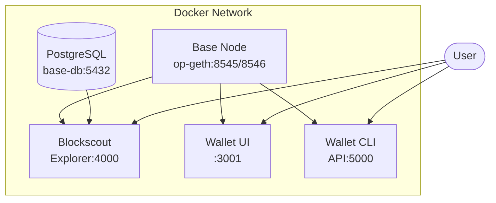

# Base Blockchain Integration

HomeLab includes optional Base L2 blockchain services for self-hosted Web3 development and experimentation.

## Architecture



## Quick Start

```bash
# 1. Generate environment
./scripts/env-generator.sh

# 2. Start blockchain services
docker compose -f docker/docker-compose.base.yml up -d

# 3. Check status
docker compose -f docker/docker-compose.base.yml ps
```

Or using Makefile:
```bash
make base-start
make base-status
```

## Services

| Service | Port | Description |
|---------|------|-------------|
| `base-node` | 8545 (HTTP), 8546 (WS) | Base L2 Geth node (light sync) |
| `base-explorer` | 4000 | Blockscout block explorer UI |
| `base-wallet` | 3001 | Simple Web3 wallet interface |
| `base-wallet-cli` | 5000 | REST API for wallet operations |
| `base-db` | 5432 (internal) | PostgreSQL for Blockscout |

## Base Node

The node runs in **light sync mode** by default (~5GB disk).

### Configuration

| Variable | Default | Description |
|----------|---------|-------------|
| `BASE_NETWORK` | `base-mainnet` | Network: `base-mainnet` or `base-sepolia` |
| `BASE_SYNC_MODE` | `light` | Sync mode: `light`, `snap`, or `full` |
| `BASE_CHAIN_ID` | `8453` | Chain ID (8453=mainnet, 84532=sepolia) |

### RPC Methods

```bash
# Get latest block number
curl http://localhost:8545 \
  -X POST -H "Content-Type: application/json" \
  -d '{"jsonrpc":"2.0","method":"eth_blockNumber","params":[],"id":1}'

# Get balance
curl http://localhost:8545 \
  -X POST -H "Content-Type: application/json" \
  -d '{"jsonrpc":"2.0","method":"eth_getBalance","params":["0xYOUR_ADDRESS","latest"],"id":1}'

# Get gas price
curl http://localhost:8545 \
  -X POST -H "Content-Type: application/json" \
  -d '{"jsonrpc":"2.0","method":"eth_gasPrice","params":[],"id":1}'
```

## Wallet CLI API

REST API for wallet operations.

### Endpoints

| Method | Endpoint | Description |
|--------|----------|-------------|
| GET | `/health` | Health check with RPC status |
| GET | `/wallet/new` | Generate new wallet |
| GET | `/wallet/balance/<addr>` | Get address balance |
| POST | `/wallet/send` | Send transaction |
| GET | `/block/<number>` | Get block info |
| GET | `/chain` | Get chain info |
| GET | `/tx/<hash>` | Get transaction details |

### Examples

```bash
# Generate new wallet
curl http://localhost:5000/wallet/new

# Check balance
curl http://localhost:5000/wallet/balance/0xYOUR_ADDRESS

# Get chain info
curl http://localhost:5000/chain

# Get latest block
curl http://localhost:5000/block/latest
```

### Sending Transactions

To send transactions, set `BASE_WALLET_PRIVATE_KEY` in your `.env`:

```bash
BASE_WALLET_PRIVATE_KEY=0x...your_private_key...
```

Then:
```bash
curl http://localhost:5000/wallet/send \
  -X POST -H "Content-Type: application/json" \
  -d '{"to": "0xRECIPIENT", "value": 0.01}'
```

> **Security Warning**: Never expose the wallet CLI externally with a funded private key!

## Open-WebUI Integration

The `BASE_RPC_URL` environment variable is available to Open-WebUI, allowing you to build custom tools that query the blockchain.

## Storage Requirements

| Mode | Disk Space | Sync Time |
|------|------------|-----------|
| Light | ~5 GB | Minutes |
| Snap | ~50 GB | Hours |
| Full | ~200+ GB | Days |

## Troubleshooting

### Node not syncing
```bash
# Check node logs
docker logs base-node -f

# Verify RPC is responding
curl http://localhost:8545
```

### Explorer not loading
```bash
# Check explorer logs
docker logs base-explorer -f

# Ensure database is healthy
docker exec base-db pg_isready
```

### Wallet API errors
```bash
# Check wallet CLI logs
docker logs base-wallet-cli -f

# Test health endpoint
curl http://localhost:5000/health
```
