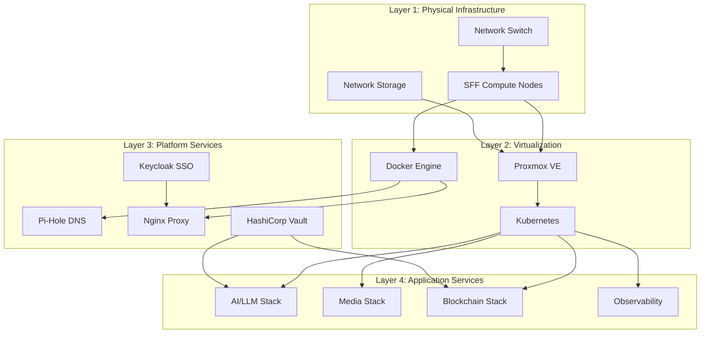
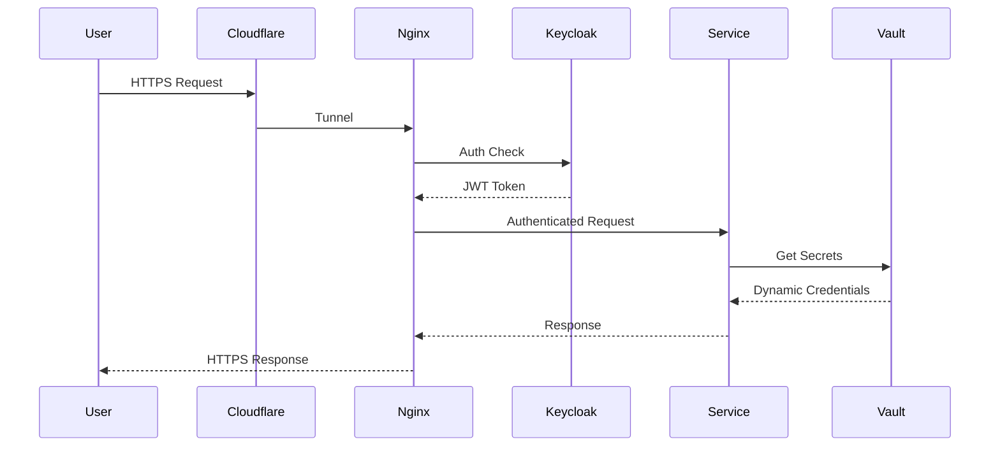

# 🏗️ Architecture Overview

HomeLab follows a layered architecture designed for modularity, security, and scalability.

## Design Principles

| Principle | Implementation |
|-----------|----------------|
| **Infrastructure as Code** | All configs in Git, reproducible deployments |
| **Horizontal Scalability** | Scale-out with multiple nodes vs scale-up |
| **Defense in Depth** | Multiple security layers, zero trust networking |
| **Observability First** | Metrics, logs, and traces for all services |
| **Offline Capable** | Works fully air-gapped once data is cached |

## System Layers

## Component Inventory

### Compute Layer

| Component | Purpose | Technology |
|-----------|---------|------------|
| **Hypervisor** | VM management | Proxmox VE |
| **Container Runtime** | Workload isolation | Docker, Podman |
| **Orchestration** | Container scheduling | Kubernetes, Docker Compose |

### Network Layer

| Component | Purpose | Technology |
|-----------|---------|------------|
| **DNS** | Name resolution, ad blocking | Pi-Hole, GoZones |
| **Reverse Proxy** | TLS termination, routing | Nginx Proxy Manager |
| **VPN** | Secure remote access | Tailscale, WireGuard |
| **Tunnel** | Public exposure | Cloudflare Tunnel |

### Storage Layer

| Tier | Use Case | Technology |
|------|----------|------------|
| **Tier 0** | Boot/OS, ephemeral | Local NVMe |
| **Tier 1** | Persistent block storage | Longhorn, Ceph |
| **Tier 2** | Bulk data, backups | NAS (NFS/SMB) |

### Security Layer

| Component | Purpose | Technology |
|-----------|---------|------------|
| **Identity** | SSO, authentication | Keycloak |
| **Secrets** | Credential management | HashiCorp Vault |
| **PKI** | Certificate management | Step-CA, cert-manager |
| **Network** | Microsegmentation | Calico, Network Policies |

## Traffic Flow

## Scalability Model

The architecture supports two scaling modes:

### Vertical Scaling (Single Node)
- Add RAM/CPU to existing node
- Best for: Lab environments, testing
- Limit: Hardware capacity

### Horizontal Scaling (Multi-Node)
- Add more SFF nodes to cluster
- Best for: Production workloads
- Requires: Kubernetes, shared storage

!!! tip "Recommended Hardware"
    - **CPU**: Intel i5/i7 6th gen+ or AMD Ryzen
    - **RAM**: 32GB minimum per node
    - **Storage**: 1TB NVMe + NAS for bulk
    - **Network**: 2.5GbE or 10GbE for storage traffic

## Related Documentation

- [Network Topology](network.md)
- [Storage Architecture](storage.md)
- [Security Model](security.md)
