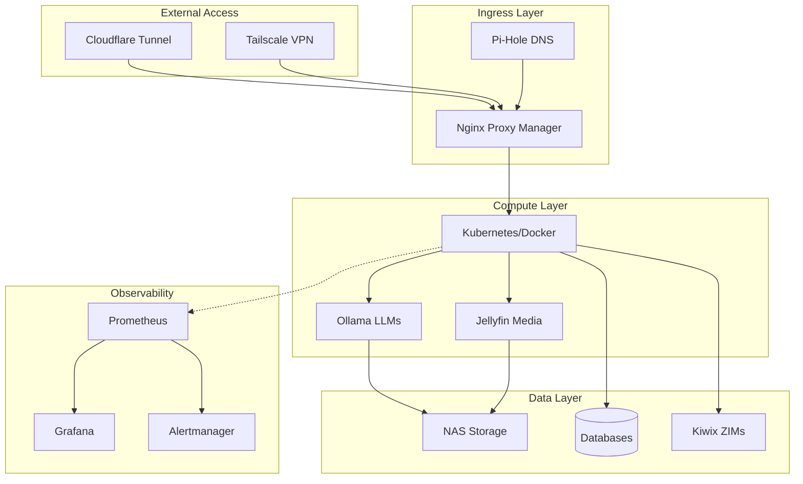

# 🏠 HomeLab Documentation

Welcome to the HomeLab documentation—your comprehensive guide to building and operating a self-hosted infrastructure platform.

## What is HomeLab?

HomeLab is a **self-hosted infrastructure platform** that provides 50+ integrated services for:

- 🤖 **Local AI** — Run 15+ LLMs locally with Ollama
- 🎬 **Media Server** — Jellyfin, *Arr stack automation
- 📚 **Offline Knowledge** — Wikipedia, StackOverflow via Kiwix
- 🔗 **Blockchain** — 31 OP-Stack L2 node support
- 🎨 **Creative AI** — Image generation, voice synthesis, music
- 🛡️ **Security** — Post-quantum TLS, secret management

## Quick Links

<div class="grid cards" markdown>

-   :rocket: **[Quick Start](getting-started/quickstart.md)**

    Get up and running in 10 minutes

-   :building_construction: **[Architecture](architecture/overview.md)**

    Understand the system design

-   :shield: **[Security](security/identity.md)**

    Secure your deployment

-   :wrench: **[Operations](operations/monitoring.md)**

    Monitor and maintain

</div>

## Architecture Overview



## Key Features

| Feature | Description |
|---------|-------------|
| **Zero Trust Networking** | Default-deny network policies, microsegmentation |
| **GitOps Ready** | ArgoCD integration for declarative deployments |
| **Observability** | Full Prometheus/Grafana/Loki stack |
| **Disaster Recovery** | Velero backups to S3-compatible storage |
| **Secrets Management** | HashiCorp Vault with dynamic secrets |
| **SSO/Identity** | Keycloak for centralized authentication |

## Getting Started

1. **Clone the repository (includes ~29GB via Git LFS):**
   ```bash
   git lfs install
   # CUSTOMIZE: Replace <your-github-username> with your GitHub username
   git clone https://github.com/<your-github-username>/home.lab.git
   cd home.lab
   ```

2. **Run the bootstrap script:**
   ```bash
   # Linux/macOS
   ./bootstrap.sh
   
   # Windows
   .\homelab.ps1
   ```

3. **Optional: Download additional models:**
   ```bash
   # Core data (ZIM, SDXL, Superchain) already included!
   ./scripts/download-models.sh  # Ollama LLMs
   ```

4. **Start services:**
   ```bash
   docker compose up -d
   ```

## Support

- 📖 [Troubleshooting Guide](operations/troubleshooting.md)
<!-- CUSTOMIZE: Replace <your-github-username> with your GitHub username -->
- 🐛 [GitHub Issues](https://github.com/<your-github-username>/home.lab/issues)
- 📜 [License](https://github.com/<your-github-username>/home.lab/blob/main/LICENSE)
